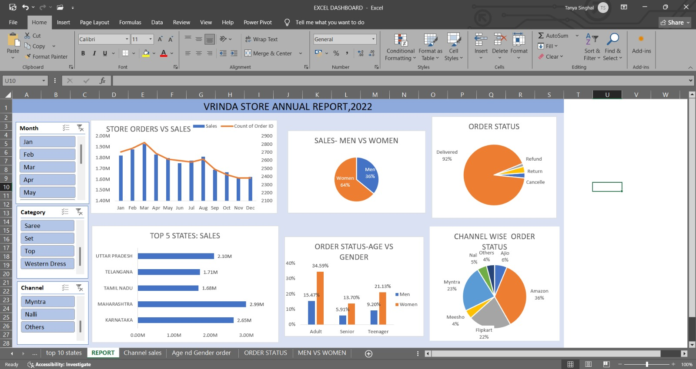

  

# Excel Sales Dashboard – India (2023)

**A fully interactive sales analysis dashboard built in Excel**  
Designed for clarity, speed, and business decisions that actually convert.

---

## 🚀 Overview

Track performance, slice by month, drill down by category and channel — all within Excel.  
No code, no BI tools — just clean logic, tight visuals, and real answers.

---

## 📌 Metrics Tracked

- Total Sales  
- Number of Orders  
- Average Order Value (AOV)  

All displayed at the top for a quick performance snapshot.

---

## 🎛️ Interactivity

- Monthly slicers  
- Product category filters  
- Sales channel filters  
- Fully interactive charts and maps

---

## 📊 Visual Components

- Bar chart: Sales vs Orders (monthly)  
- Map: Sales distribution across India  
- Pie chart: Gender-based sales breakdown  
- Pie chart: Sales by channel (Amazon, Flipkart, etc.)  
- Top 5 states: Ranked by revenue  

---

## 🧹 Data Cleaning + Prep

- Removed duplicates  
- Filled missing values  
- Generated `Month` field using `=TEXT(Date, "mmm")`  
- Created custom age buckets  
- Calculated AOV using `=Amount / Quantity`

---

## 🧠 Strategic Insights

- 65% of orders from women aged 30–49  
- Top states: Maharashtra, Karnataka, UP  
- 80% of sales from 3 platforms: Amazon, Flipkart, Myntra  
